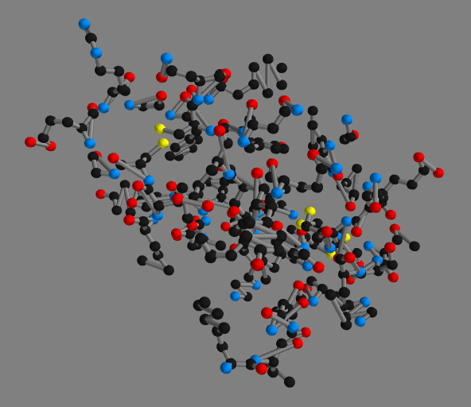
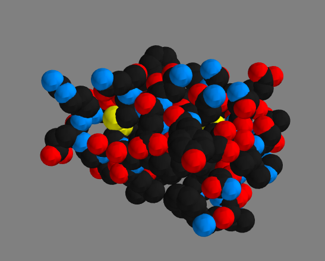
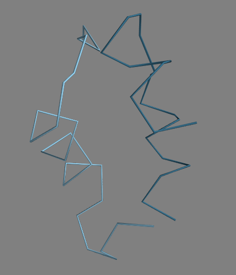
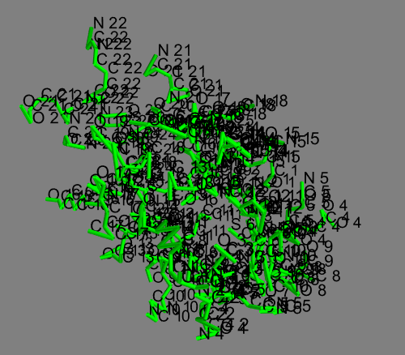
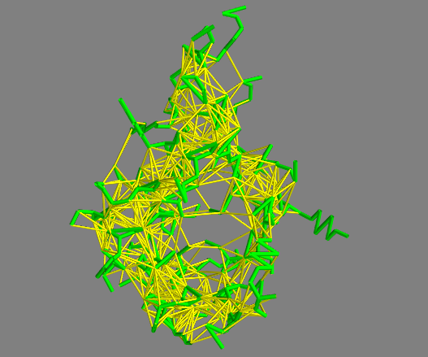

# 3D_Visual_pdb_py
3D vizualisation of pdb files with python

---

### Ball and stick representation :

### Space filling representation :

### Ribbon representation :

### Lines representation :

### Distance representation (less than 4A) :

---

Hocine Meraouna